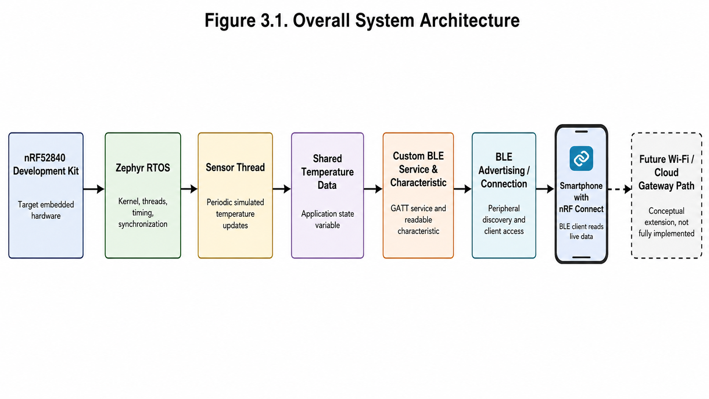
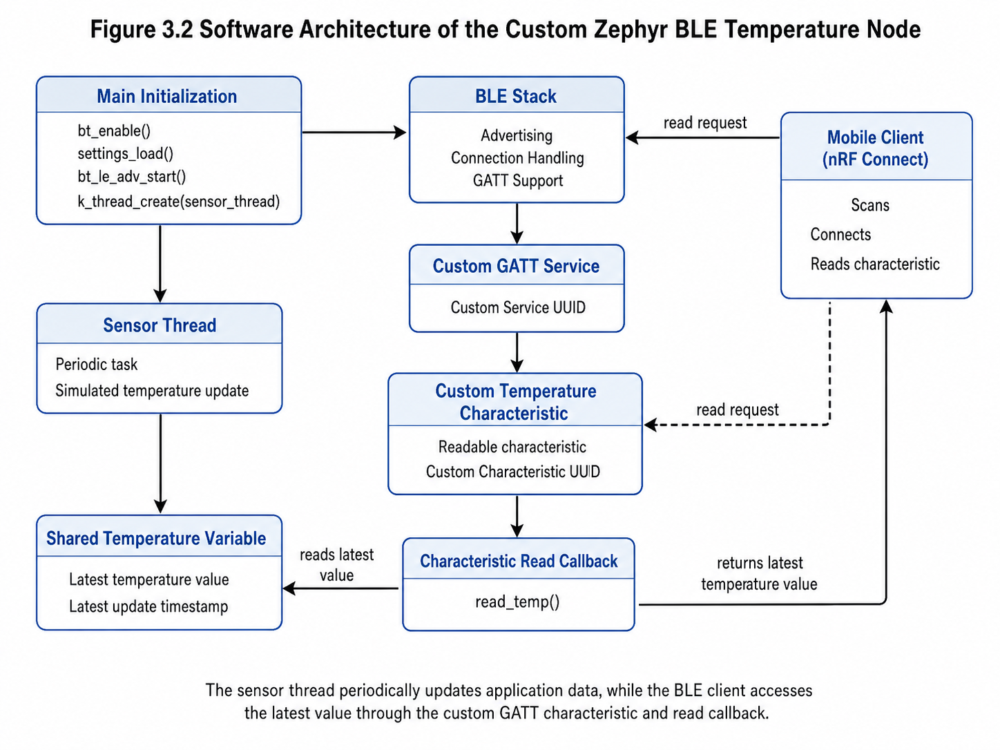
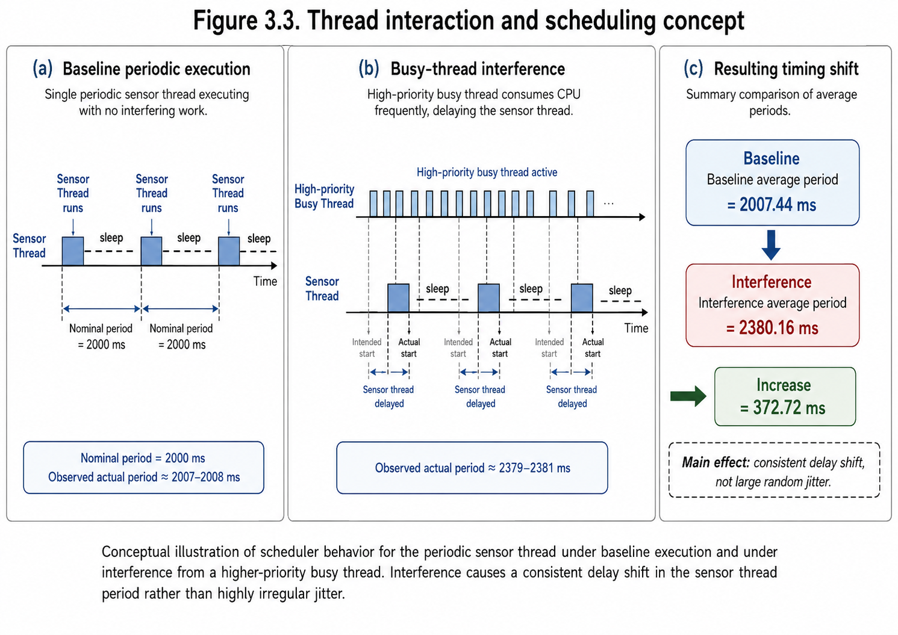
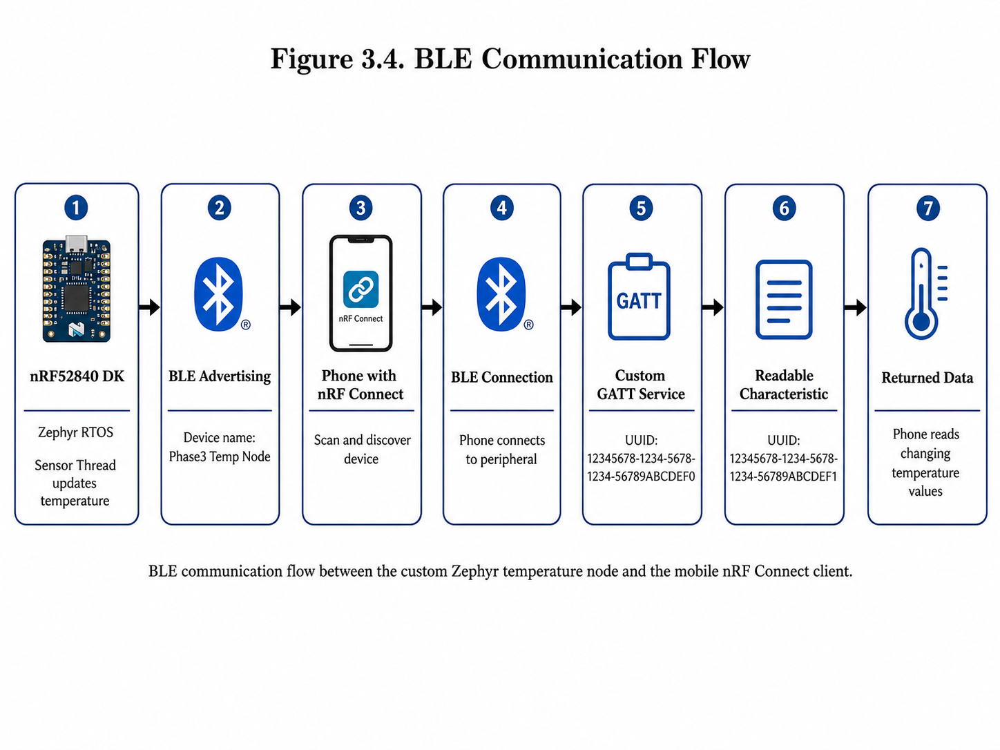
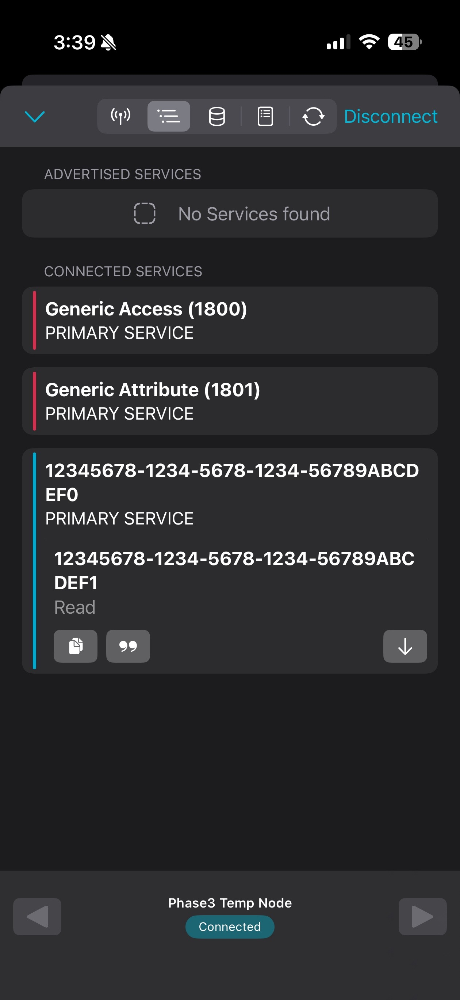
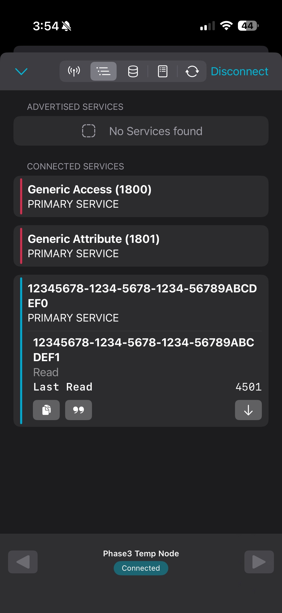
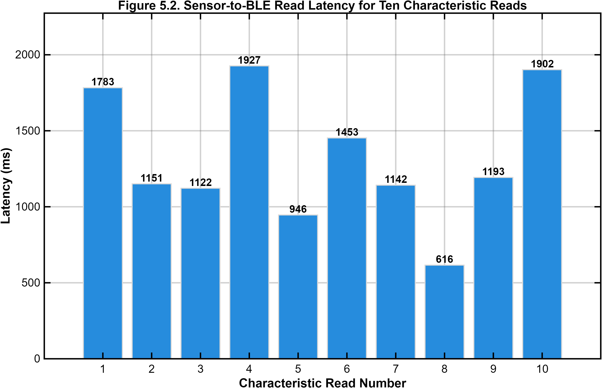
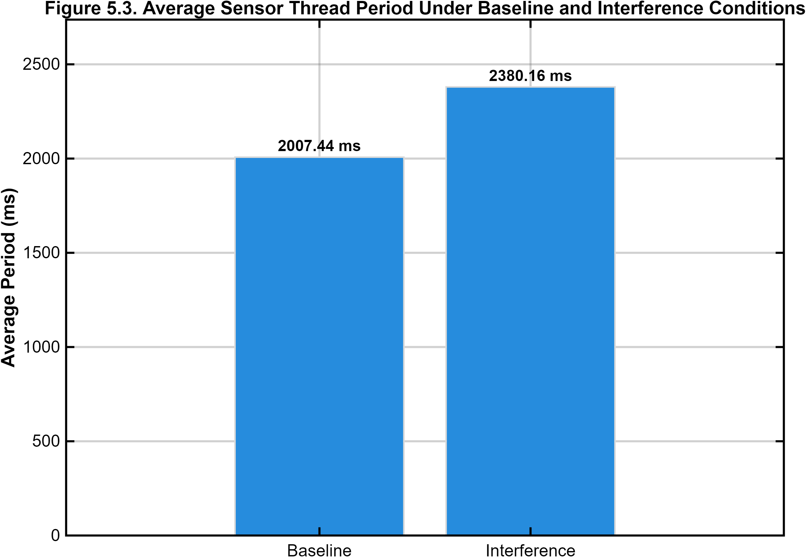
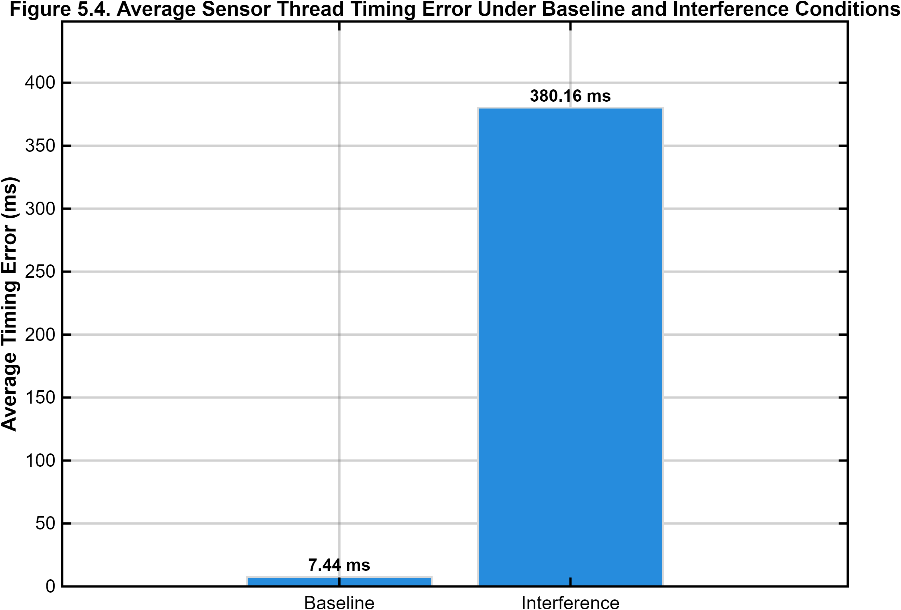

# Zephyr RTOS BLE Temperature Monitoring Node on nRF52840 DK

## Overview

This project implements and evaluates a Zephyr RTOS-based BLE temperature monitoring node on the Nordic nRF52840 Development Kit. The system uses a simulated temperature source running in a Zephyr sensor thread, protects shared application state with a mutex, exposes the latest temperature value through a custom BLE GATT service, and validates BLE reads from a mobile phone using nRF Connect.

The project also evaluates Zephyr RTOS scheduler behavior through multithreading, priority scheduling, starvation, mutex synchronization, and timing experiments. Final timing measurements compare baseline sensor-thread execution against execution under higher-priority CPU interference.

This project was completed as part of EE 695 research work in Electrical and Computer Engineering.



---

## Important Files

- [Buildable Zephyr app version](app/src/main.c)
- [Final BLE node source code](src/phase3_ble_temperature_node/main.c)
- [Scheduler experiment source files](src/phase2_scheduler_experiments/)
- [Timing analysis source files](src/phase4_timing_analysis/)
- [MATLAB result plotting script](analysis/phase4_results.m)
- [Final project report](docs/final-report.pdf)

---

## Hardware and Software Stack

### Hardware

- Nordic nRF52840 Development Kit
- Bluetooth Low Energy capable mobile phone
- USB serial connection for logging and debugging
- Nordic Power Profiler Kit II used for exploratory setup testing

### Software

- Zephyr RTOS
- Embedded C
- West build system
- CMake / Ninja
- Nordic nRF Connect mobile app
- MATLAB for result plotting and timing visualization

---

## Project Features

- Zephyr RTOS application development on the nRF52840 DK
- BLE peripheral configuration and advertising
- Custom BLE GATT service
- Readable BLE temperature characteristic
- Simulated periodic temperature updates
- Mutex-protected shared temperature state
- RTOS thread creation and scheduling experiments
- Priority scheduling and starvation experiments
- Mutex-protected UART output
- Application-level latency measurement using `k_uptime_get()`
- Baseline and CPU-interference timing comparison
- MATLAB-generated performance plots

---

## Key Technical Details

- The BLE application uses a simulated temperature source rather than an external physical temperature sensor.
- A Zephyr thread periodically updates the latest temperature value.
- A mutex protects shared access between the sensor-update thread and the BLE GATT read callback.
- A custom BLE GATT service exposes the latest temperature value as a readable characteristic.
- BLE validation was performed using the nRF Connect mobile application.
- Timing experiments used `k_uptime_get()` to compare sensor-thread behavior under baseline and CPU-interference conditions.
- The code is organized by project phase, with a buildable version of the final BLE node placed in the `app/` folder.

---

## System Architecture

The project is organized around a simulated embedded sensing node.

1. A Zephyr sensor thread periodically updates a simulated temperature value.
2. The latest temperature value is stored in shared application state.
3. A mutex protects access to the shared temperature value.
4. A custom BLE GATT characteristic exposes the latest value.
5. A mobile phone connects using nRF Connect and reads the characteristic.
6. Timing experiments measure BLE-read latency and sensor-thread scheduling behavior.







---

## BLE Temperature Node

The final BLE prototype uses a custom service and characteristic to expose the latest simulated temperature reading.

Core behavior:

- Initializes the Zephyr Bluetooth stack
- Starts BLE advertising
- Registers a custom GATT service
- Runs a periodic simulated sensor thread
- Updates the temperature value every cycle
- Allows a mobile client to read the latest value

The final BLE node source code is located here:

`src/phase3_ble_temperature_node/main.c`

A buildable app version is located here:

`app/src/main.c`

nRF Connect validation:





---

## RTOS Scheduler Experiments

The project includes a set of Zephyr RTOS experiments used to study thread behavior.

Experiment files are located in:

`src/phase2_scheduler_experiments/`

Included experiments:

- Basic multithreading
- Priority scheduling
- UART output interference
- Mutex-protected UART output
- High-priority busy thread behavior
- Starvation behavior
- Busy thread with short sleep
- Equal-priority thread behavior

These experiments helped validate how Zephyr schedules threads under different priority and blocking conditions.

---

## Timing and Performance Analysis

Phase 4 measured application-level timing behavior using Zephyr uptime timestamps.

Timing-analysis code is located in:

`src/phase4_timing_analysis/`

Included timing experiments:

- BLE read latency measurement
- Baseline sensor-thread timing
- Sensor-thread timing under higher-priority CPU interference
- LED test for exploratory power-measurement setup

### BLE Read Latency

The BLE latency experiment measured the time between the most recent simulated sensor update and the BLE characteristic read.



### Sensor Thread Timing

The baseline timing experiment measured how close the sensor thread stayed to its intended period under normal conditions.

The interference experiment introduced a higher-priority busy thread to observe how CPU load affected sensor-thread timing.





---

## Key Results

- Implemented a working Zephyr RTOS BLE peripheral on the Nordic nRF52840 DK.
- Validated custom BLE service discovery and characteristic reads using nRF Connect.
- Demonstrated mutex-protected shared state between a simulated sensor thread and a BLE read callback.
- Compared baseline sensor-thread timing against timing under higher-priority CPU interference.
- Used MATLAB to generate performance plots for BLE-read latency and scheduler timing behavior.
- Attempted exploratory power-measurement setup using Nordic Power Profiler Kit II, but did not treat the readings as formal quantitative results due to measurement setup limitations.

---

## Repository Structure

```text
│
├── app/
|   ├──CMakeLists.txt
|   ├──prj.conf
|   ├──src/
|   └──main.c
|
├── docs/
│   └── final-report.pdf
│
├── src/
│   ├── phase2_scheduler_experiments/
│   │   ├── basic_multithreading.c
│   │   ├── priority_garbled_uart.c
│   │   ├── mutex_uart_output.c
│   │   ├── high_priority_busy_no_relief_v1.c
│   │   ├── high_priority_busy_no_relief_v2.c
│   │   ├── high_priority_busy_with_sleep.c
│   │   ├── experiment_1a_busy_with_sleep.c
│   │   ├── experiment_1b_busy_no_sleep.c
│   │   └── experiment_1c_equal_priorities.c
│   │
│   ├── phase3_ble_temperature_node/
│   │   └── main.c
│   │
│   └── phase4_timing_analysis/
│       ├── ble_latency_measurement.c
│       ├── baseline_sensor_timing.c
│       ├── interference_sensor_timing.c
│       └── led_power_test.c
│
├── analysis/
│   └── phase4_results.m
│
├── results/
│   ├── sensor-to-ble-latency.png
│   ├── average-sensor-period.png
│   └── average-timing-error.png
│
└── images/
|   ├── system-architecture.png
|   ├── software-architecture.png
|   ├── threading-model.png
|   ├── ble-data-flow.png
|   ├── nrf-connect-custom-service.jpeg
|   ├── nrf-connect-temperature-read.jpeg
|   └── power-measurement-setup.jpeg
|
├── README.md
└── .gitignore
```

---

## How to Build and Run

This project was developed using Zephyr RTOS and the Nordic nRF52840 DK.

The buildable version of the final BLE temperature node is located in the `app/` folder.

From the root of the repository, build with:

```bash
west build -b nrf52840dk/nrf52840 app --pristine
```

To flash:

```bash
west flash
```

To monitor serial output:

```bash
python -m serial.tools.miniterm COM_PORT 115200
```

Replace `COM_PORT` with the actual serial port assigned to the nRF52840 DK.

Example on Windows:

```bash
python -m serial.tools.miniterm COM10 115200
```

---

## Build Note

The source files in `src/` are organized by experiment phase. Each `.c` file represents the `main.c` implementation used for that experiment.

The `app/` folder contains the buildable Zephyr application version of the final BLE temperature node.

To build a different experiment, copy the desired experiment file into `app/src/main.c`, then rebuild using:

```bash
west build -b nrf52840dk/nrf52840 app --pristine
```

---

## Notes and Limitations

- The temperature value is simulated; this version does not use an external physical temperature sensor.
- BLE validation was performed using the nRF Connect mobile app.
- Power measurement setup was explored using Nordic PPK2, but the quantitative readings were not treated as final due to setup limitations.
- The code files are organized by experiment phase rather than as a single production firmware application.
- The `app/` folder provides a buildable version of the final BLE temperature node.

---

## Skills Demonstrated

- Embedded C development
- Zephyr RTOS application development
- BLE GATT service implementation
- Nordic nRF52840 DK bring-up
- RTOS threading and synchronization
- Mutex-protected shared data
- Scheduler behavior analysis
- Timing measurement using `k_uptime_get()`
- Serial debugging
- Mobile BLE validation with nRF Connect
- MATLAB-based result visualization
- Technical documentation and research reporting

---

## Author

Oluwaferanmi Arowoshola

M.S. Electrical & Computer Engineering

Embedded Systems · Zephyr RTOS · Bluetooth Low Energy · Real-Time Systems · IoT
